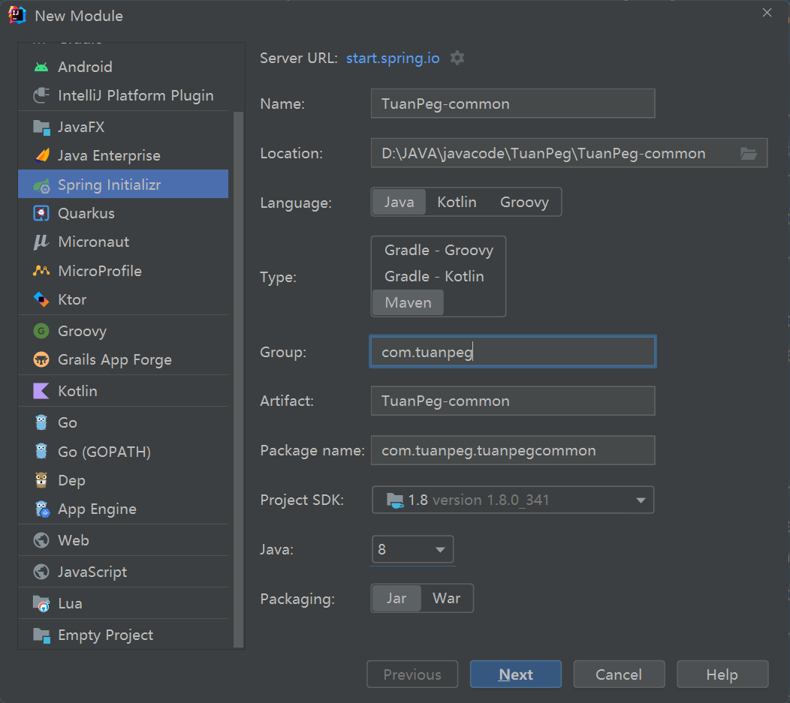

# TuanPeg
## 环境配置
springboot 2.7.9

jdk 8(java 8)

创建新的服务时：

如图所示，

将微服务的名字加一个TuanPeg前缀

包名为com.tuanpeg

引入基础的web与openFeign

## 公共的模块放在TuanPeg—common

里面已经引入mybatisPlus，lombok，nacos，ribbon，springcloudAlibaba与mysql的连接池jar包（相应的版本进入common查看）

不需要特定的组件的可在引入的时候排除

## 开发环境
### （在云服务器上，先部署单台，后期集群）

人人开源的数据库配置

redis(6.0.8)

mysql (5.7 安装8.0版本老是报错)

### 在本地服务器中
nacos用自己本机的调式，最后项目再用同一个

